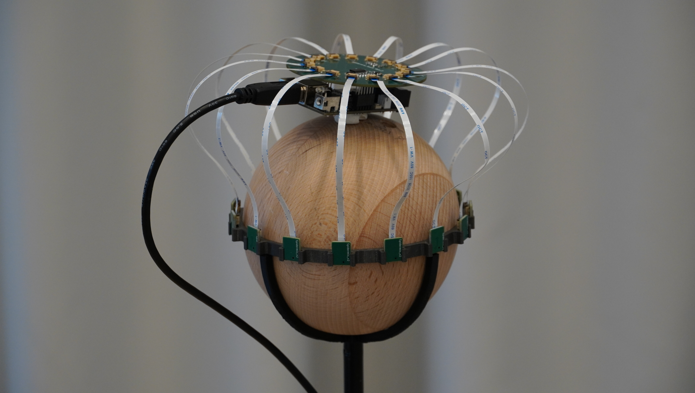
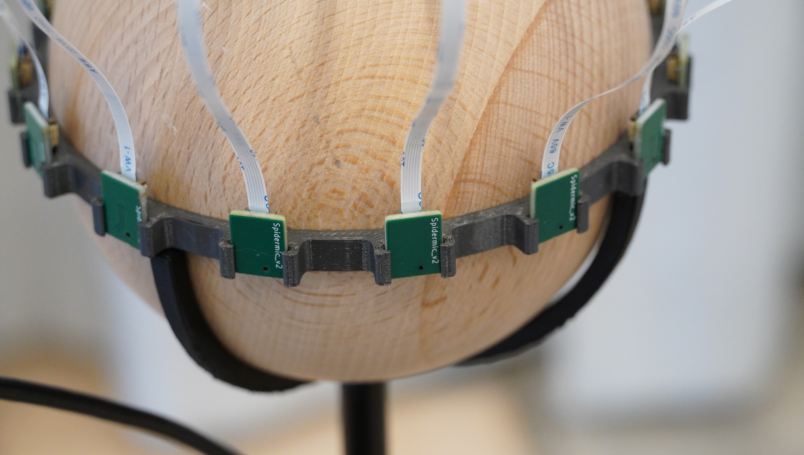

# Spidermic
 
Spidermic is an low cost circular microphone array. For use in audio measurement applications such as [ambisonics](https://github.com/AppliedAcousticsChalmers/ambisonics-for-insta360-pro).
## Features
* Low cost spherical microphone array with up to 15 omnidirection microphones.
* Plug and play compatible with [Minidsp MCHstreamer](https://www.minidsp.com/products/usb-audio-interface/mchstreamer-lite).
* 15 PDM Infineon M73D122V01 Microphones.
* No programming required!
## Repository Organization
* [kicad/](kicad/) - KiCad schematic, layout and fabrication files for both the main PCB and microhpones
* [mounts/](mounts/) - STL Files for the ring mount.
## Documentation
The main board has 15 flatflex connectors, with a 24 degree angle between them, which allows for the microphones to be mounted equidistant to each other on the hemisphere of an wooden sphere with a radius of 60mm.
### Minidsp MCH-Streamer
The main board of the mic array is mounted on top of a MiniDSP MCH-Streamer connected to J2. 
Since the Infineon microphones work with 1.8v logic and the MCH-steamer only outputs 3.3v, I used Ti-SN74LVC8T245
level shifting from 3.3V to 1.8V of the data and clock signals to and from the MCH-streamer.
### Hand solder
While it should be possible to hand solder the current version of the main board, it might be tricky since components are somewhat tightly placed around the pinheader. This should get fixed in future versions.
I cannot recommend handsoldering the microphone boards since the microphones are very particular with paste application and temperature.
JLCpcba PCBA worked with well for the microphones.
### Mounting hardware
The ring mount should be printed in PETG,fit around the sphere and the microphones are also friction fit in the "claws". 
Squeezing the ring to spread the claws makes it easier to mount the microphones as the tolerances are tight. 
